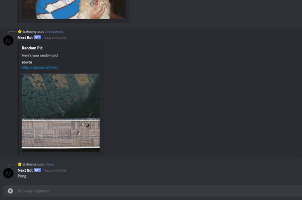

# NextBot: Serverless Discord Bot with Next.js

Serverless Discord bot using Discord's
[slash commands webhook](https://discord.com/developers/docs/interactions/slash-commands#receiving-an-interaction) and
[Next.js](https://nextjs.org/).



## Try it out

[](https://discord.gg/NmXuqGgkb3)

Join https://discord.gg/NmXuqGgkb3 and use one of the available slash commands.

- `/ping`
- `/randompic`

Or, add NextBot to your own server:
https://discord.com/api/oauth2/authorize?client_id=837427503059435530&permissions=2147483648&scope=bot%20applications.commands

You can also send slash commands through DM the bot once you're in a mutual server with the bot!

An accompanying static web app also shows the registered commands: https://nextjs-discord-bot.vercel.app/

## Technologies

- Receives slash commands through
  [Discord's Interaction webhook](https://discord.com/developers/docs/interactions/slash-commands#receiving-an-interaction),
  allowing for a completely serverless approach!
- Built on Next.js: easily build an accompanying dashboard web app in the same repo and call your API directly with SSR!
- Typescript <3 (thanks to https://github.com/discordjs/discord-api-types for Discord types!)

## Development

Requires a Node.js version that can run Next.js.

### Setup

Follow the one-time setup as follows:

- Clone the repo
- Create a Discord app and bot
- Copy `.env.local.example` into a new file `.env.local` and fill in the blanks with the values from your Discord app
- Register the slash commands. You can learn more about registering commands in the
  [Discord API docs](https://discord.com/developers/docs/interactions/slash-commands#registering-a-command). I created
  the commands by leveraging `createGlobalCommand` in `services/discord.ts`. I added this to`getServerSideProps` in
  `pages/index.tsx` and ran it ONCE (i.e. refresh the page ONCE).

```tsx
await createGlobalCommand({
  name: "randompic",
  description: "Get a random picture",
  options: [
    {
      name: "type",
      description: "What type of picture would you like?",
      type: 3,
      required: true,
      choices: [
        { name: "cat", value: "cat" },
        { name: "dog", value: "dog" },
        { name: "generic", value: "picsum" },
      ],
    },
  ],
})

await createGlobalCommand({
  name: "ping",
  description: "Ping pong! I'll respond with pong.",
})
```

You could also make the request via Postman, curl, etc. but I'm lazy

### Local Development

- Run `yarn dev`
- Tunnel your localhost:3000 with a tool like [ngrok](https://ngrok.com/). `ngrok http 3000`
- Add the `<YOUR_PUBLIC_TUNNELED_NGROK_URL>/api/interactions` as the `Interactions Endpoint URL` in your Discord app.
- Add the app to a server and slide in its DMs! Your registered slash commands should be available now.

### Deploy on Vercel

[](https://vercel.com/new/git/external?repository-url=https%3A%2F%2Fgithub.com%2Fjzxhuang%2Fnextjs-discord-bot)

After deploying, add `<YOUR_VERCEL_URL>/api/interactions` as the `Interactions Endpoint URL` in your Discord app.
